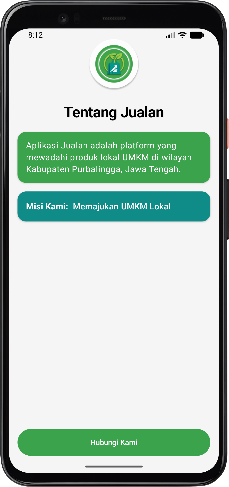
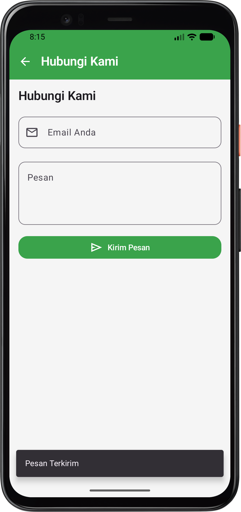

# Praktikum Pemrograman Mobile - Aplikasi Jualan

## Data Diri

* **Nama**: Zahwa Nafiza Azzahra
* **NIM**: H1D024015
* **Shift KRS**: H
* **Shift Sekarang**: F

---

## Penjelasan Program

Aplikasi ini merupakan aplikasi mobile Android berbasis **Jetpack Compose** (Kotlin) yang dibuat untuk memenuhi tugas Praktikum Pemrograman Mobile. Aplikasi **Jualan** adalah platform yang mewadahi serta mempromosikan produk-produk lokal UMKM di wilayah Kabupaten Purbalingga, Jawa Tengah.

### Fitur dan Halaman Aplikasi:

1. **Halaman Tentang Jualan (`BasicInfoScreen`)**:
   * **Logo Aplikasi**: Menampilkan logo lingkaran resmi aplikasi Jualan.
   * **Judul**: Menampilkan teks *"Tentang Jualan"* dengan tipografi tebal dan rapi.
   * **Card Deskripsi Platform**: Card bernuansa hijau (*Primary*) yang menjelaskan profil aplikasi dalam mewadahi UMKM lokal Purbalingga.
   * **Card Misi Kami**: Card bernuansa hijau tua/teal (*Tertiary*) dengan penegasan komitmen *"Misi Kami: Memajukan UMKM Lokal"*.
   * **Tombol Navigasi**: Tombol *"Hubungi Kami"* di bagian bawah untuk berpindah ke halaman form pesan.

2. **Halaman Hubungi Kami (`HubungiKamiScreen`)**:
   * **Top App Bar**: Dilengkapi tombol kembali (*Back button*) untuk memudahkan navigasi antar halaman.
   * **Input Email**: Menggunakan `OutlinedTextField` lengkap dengan ikon email untuk memasukkan alamat email pengirim.
   * **Input Pesan**: Menggunakan `OutlinedTextField` area teks untuk menulis isi pesan atau pertanyaan.
   * **Tombol Kirim Pesan**: Tombol interaktif dengan ikon kirim (*Send*) yang memicu tampilan notifikasi **Snackbar** (*"Pesan Terkirim"*).

---

## Hasil Projek

Berikut adalah tangkapan layar (*screenshot*) hasil implementasi antarmuka aplikasi:

### 1. Halaman Tentang Jualan

### 2. Halaman Hubungi Kami

